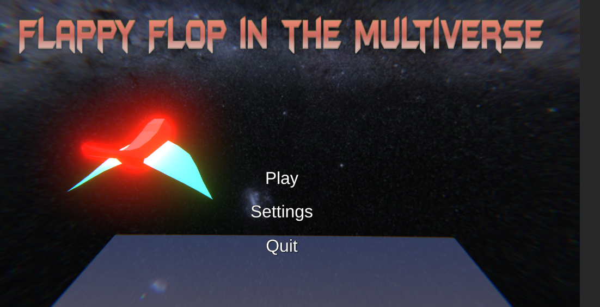
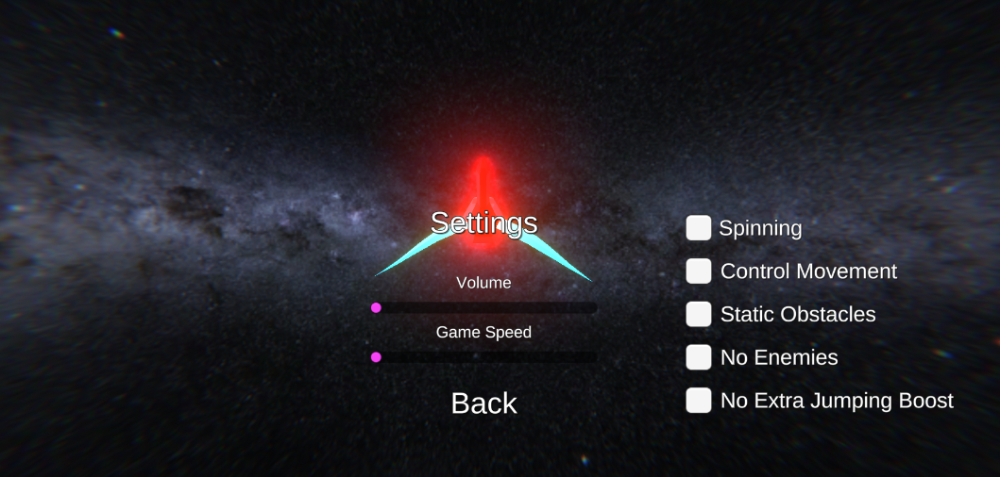
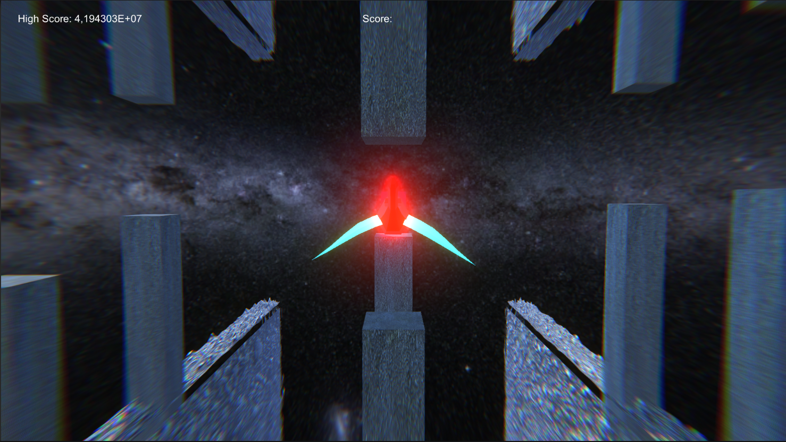
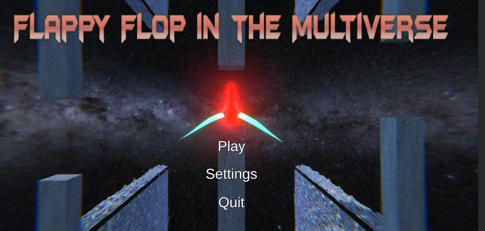

# FlappyFlop

Project for GTAT1 course / SoSe 20202/ IMI - HTW Berlin

## Game Programming

- [ ] physics-basierte Anwendung

- [x] Punktesystem (Highscore, File-Persistierung)

- [x] Statemachine (mind. 3 States, z.B. Start, Play, Game Over, Pause)

- [x] Prefabs Spawnen (z. B. Gegner, Punkte, Hindernisse)

- [x] Korrekte Verwendung von Time, Update, FixedUpdate, Update, …

## Abgabe & Umsetzung

- [x] Platform Build lauffähig

- [x] Code Segmentierung (SOLID, DRY, Single Responsibility)

- [x] Form, Comments

## Bonuspunkte (maximal 2 Stück werden gewertet)

- [x] einstellbare Schwierigkeit

- [ ] “smarte” Nutzung von Physics

- [ ] Verwendung von geseedetem Noise für Interaktion (z.B. Spawning)

- [x] Physics.Raycast und MonoBehaviour.OnCollision verwendet

## How to play the game
To control the bird you can use the *space bar* and to *switch lanes* you can use the *arrows*.

The concept of the game is easy to understand, there are obstacles over three lanes, most of the have holes that you can pass through but sometimes some don't have 
that hole and if you hit them you will lose the game. 

Whenever you hit *ESC* the game pauses and you can hit *ESC* again to unpause. 
If you lose and you see the game over screen you could also press *ESC* to restart the game. 

## Images 

